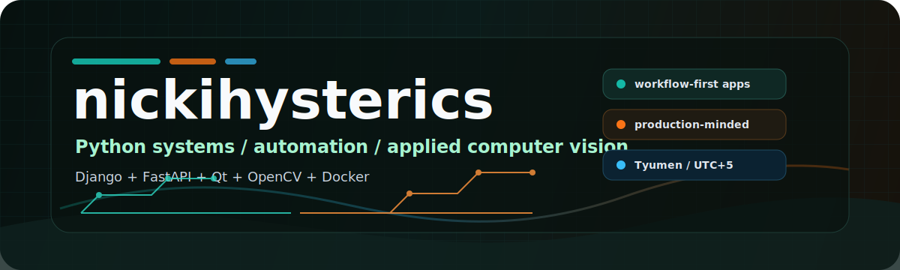
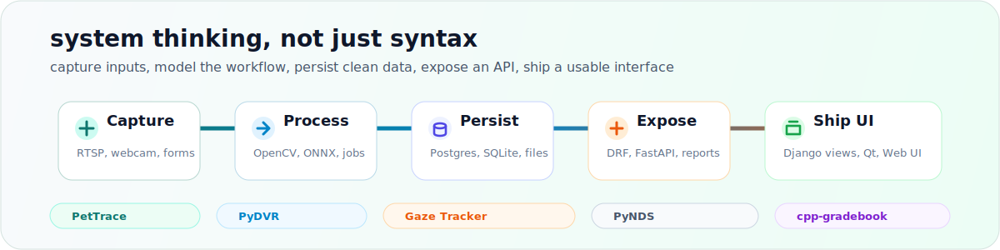

<p align="center">
  
</p>

<!-- profile-readme-refresh: 2026-05-07 -->

<p align="center">
  <a href="https://github.com/nickihysterics">
    
  </a>
  <a href="https://t.me/general_itu">
    
  </a>
</p>

<p align="center">
  I build practical Python systems for real workflows: business platforms, desktop tools,
  video processing, document automation and API-first prototypes.
</p>

<p align="center">
  
</p>

<p align="center">
  
</p>

## Current Signal

```txt
role        applied software developer
base        Tyumen, Russia
focus       Python backends, desktop automation, computer vision, internal tools
style       make it useful first, make it maintainable next
```

## What I Build

| Area | What usually matters |
| --- | --- |
| Backend platforms | Django, DRF, PostgreSQL, Redis, Celery, RBAC, audit trails, Dockerized delivery |
| Desktop tools | PySide/PyQt, local data storage, file import/export, Windows packaging |
| Computer vision | OpenCV, ONNX models, webcam/RTSP pipelines, calibration-heavy prototypes |
| Business automation | Excel/Word generation, admin panels, reports, structured workflows |

## Featured Work

| Project | Scope | Stack |
| --- | --- | --- |
| [PetTrace](https://github.com/nickihysterics/PetTrace) | Veterinary clinic automation: registry, visits, lab, inventory, finance, CRM, reports and audit | Python, Django, DRF, PostgreSQL, Redis, Celery, Docker |
| [PyDVR](https://github.com/nickihysterics/PyDVR) | Desktop DVR for IP cameras with RTSP preview, scheduled recording and local settings | Python, PyQt5, OpenCV, SQLite |
| [py-Proffesionals-2026](https://github.com/nickihysterics/py-Proffesionals-2026) | Local gaze tracking prototype with calibration, FastAPI and Web UI | Python, OpenCV, ONNX, FastAPI, Docker |
| [py-nds-russia](https://github.com/nickihysterics/py-nds-russia) | VAT calculator with Excel import/export and Word specification generation | Python, PySide6, Qt WebEngine, openpyxl, python-docx |
| [cpp-gradebook](https://github.com/nickihysterics/cpp-gradebook) | Console gradebook with students, groups, subjects, marks, reports and export | C++, SQLite |
| [php-hotel](https://github.com/nickihysterics/php-hotel) | Hotel booking demo with admin panel and containerized PHP/MySQL stack | PHP, MySQL, Docker, Nginx |

## GitHub Telemetry

<p align="center">
  
  
</p>

<p align="center">
  <picture>
    <source media="(prefers-color-scheme: dark)" srcset="https://raw.githubusercontent.com/nickihysterics/nickihysterics/output/github-contribution-grid-snake-dark.svg" />
    <source media="(prefers-color-scheme: light)" srcset="https://raw.githubusercontent.com/nickihysterics/nickihysterics/output/github-contribution-grid-snake.svg" />
    
  </picture>
</p>
