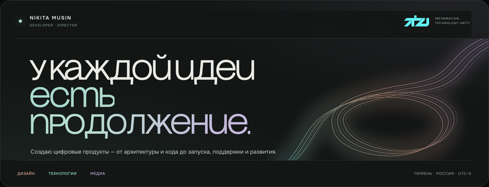
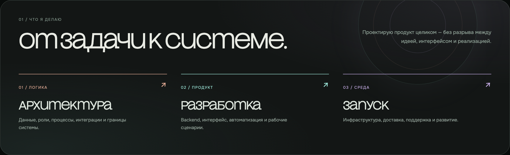
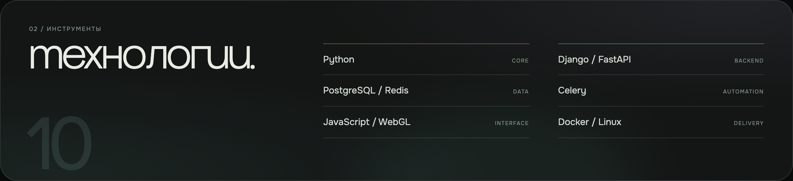
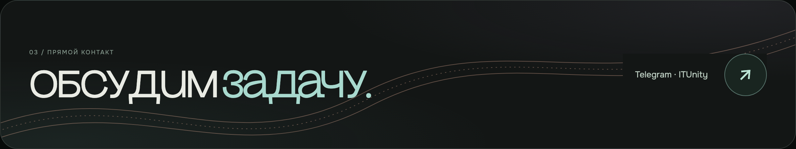

  

  <a href="https://itunity.dev/">ITUnity</a>
  &nbsp;·&nbsp;
  <a href="https://t.me/general_itu">Telegram</a>

 

## обо мне

Я — **Никита Мусин**. Разработчик и директор ITU.

Проектирую цифровые продукты целиком: разбираюсь в задаче, собираю архитектуру и интерфейс, пишу код, запускаю и продолжаю развивать систему после релиза.

  

## ITU

**Information Technology Unity** объединяет дизайн, технологии и медиа в одной команде. Мы создаём сайты, веб-сервисы и цифровые системы для бизнеса — от первой идеи до работающего продукта.

[Открыть itunity.dev ↗](https://itunity.dev/)

## технологии

  

## на связи

По вопросам разработки и сотрудничества — [Telegram](https://t.me/general_itu) или [itunity.dev](https://itunity.dev/).

  

