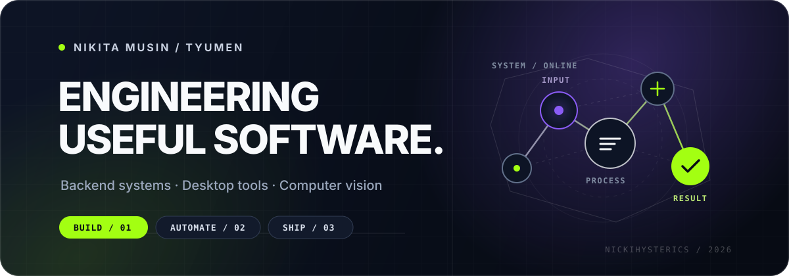

  

  
  
  

  Разрабатываю прикладные системы: от backend и бизнес-логики до desktop-интерфейсов, 
  computer vision и автоматизации документов. Люблю проекты, где софт снимает рутину,
  а не добавляет новую.

## Избранные проекты

<table>
  <tr>
    <td width="50%" valign="top">
      <h3><a href="https://github.com/nickihysterics/PetTrace">01 — PetTrace</a></h3>
      
Платформа автоматизации ветеринарной клиники: приёмы, лаборатория, склад, финансы, CRM, отчёты и аудит.

      
<code>Django</code> <code>DRF</code> <code>PostgreSQL</code> <code>Redis</code> <code>Celery</code>

    </td>
    <td width="50%" valign="top">
      <h3><a href="https://github.com/nickihysterics/hotel-website">02 — Hotel Website</a></h3>
      
Сайт и PMS отеля в одном продукте: бронирование, услуги, платежи, роли сотрудников и аналитика.

      
<code>PHP 8.2</code> <code>MySQL</code> <code>Docker</code> <code>Nginx</code>

    </td>
  </tr>
  <tr>
    <td width="50%" valign="top">
      <h3><a href="https://github.com/nickihysterics/PyDVR">03 — PyDVR</a></h3>
      
Desktop DVR для IP-камер: RTSP-просмотр, запись по расписанию, ротация архива и локальные настройки.

      
<code>Python</code> <code>PyQt5</code> <code>OpenCV</code> <code>SQLite</code>

    </td>
    <td width="50%" valign="top">
      <h3><a href="https://github.com/nickihysterics/py-Proffesionals-2026">04 — Gaze Tracker</a></h3>
      
Локальный трекер взгляда с девятиточечной калибровкой, ONNX-моделью лица, API и Web UI.

      
<code>OpenCV</code> <code>ONNX</code> <code>FastAPI</code> <code>Docker</code>

    </td>
  </tr>
</table>

  <a href="https://github.com/nickihysterics/py-nds-russia">PyNDS →</a>&nbsp;&nbsp;
  <a href="https://github.com/nickihysterics/cpp-gradebook">C++ Gradebook →</a>&nbsp;&nbsp;
  <a href="https://github.com/nickihysterics?tab=repositories">Все репозитории →</a>

## Что я собираю

- **Business systems** — роли и права, сложные workflow, CRM, аналитика, фоновые задачи и аудит.
- **Desktop & vision** — Qt-приложения, RTSP/webcam-пайплайны, OpenCV и локальные модели.
- **Automation** — импорт и экспорт Excel, генерация Word, отчёты и интеграции через API.
- **Delivery** — воспроизводимое окружение, Docker, PostgreSQL, Redis, Nginx и CI.

## Инструменты

  

## Активность

  <picture>
    <source media="(prefers-color-scheme: dark)" srcset="https://raw.githubusercontent.com/nickihysterics/nickihysterics/output/github-contribution-grid-snake-dark.svg" />
    <source media="(prefers-color-scheme: light)" srcset="https://raw.githubusercontent.com/nickihysterics/nickihysterics/output/github-contribution-grid-snake.svg" />
    
  </picture>

  Make it useful · Make it maintainable · Ship it

